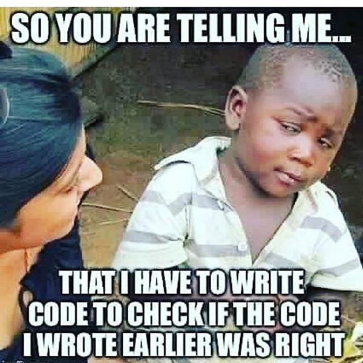

## Our own functions!

Last time, we already explored how we can use functions in Racket. In this part, we explore how to create our own functions. How exciting!

Let's say, for example, we want to write a function that takes a number and gives back (returns) it's square. We'll call it `square`, appropriately enough.

How do we define functions in Racket? By calling a function of course! The `define`-function to be precise.

```scheme
(define (square x) (* x x))
```

Alright one step at a time. As we said, to define a function, we call `define`. `define` takes two arguments, the first one is our function head, so `(square x)` which is first the name of the function and then it's parameters, just x in our case. The head is basically just the way we want to use our function later. The second parameter, the function body, is what we want to return. It can be a primitive or the result of a function call or a function itself. In our case, it is `(* x x)` - the square of `x`.

[[tip | CONVENTION]]
| In Racket function, argument and variable names are all named by convention is **kebab-case**. That means everything is lower-case and words are separated with a “-”.

Now that we have our `square` function, we can use it like any other function.

```scheme
(square 2)
> 4
(square 8)
> 64
```

We will always get the same result, as if we had just used `*`:

```scheme
(* 2 2)
> 4
(* 8 8)
> 64
```

[[tip | TIP]]
| Racket already has this square function; it is called `sqr`.

Why is it helpful to create function? Because most functions are a bit more complex than squaring numbers and because we are less prone to errors, if we split our program up in functions. Let's consider this example: We want to calculate the area of a circle (A = π \* r<sup>2</sup>). This is short enough, we don't really need a function, right? Anywhere we want to use it, we just do this:

```scheme
;; ...
(* 3.14 (sqr r))
;; ...
```

After a few weeks, we copied this code dozens of times across our project with over a 1000 lines of code. But later on we realize our results are not accurate enough, because our approximation for pi is too simple. To fix this, we have to use our new approximation **everywhere** we used the old one. If we miss it just once, we still aren't accurate enough. Had we just written a function, we could have just edited it once.

```scheme
;; Much more accurate (For reference: https://www.youtube.com/watch?v=bFNjA9LOPsg)
(define (area-of-circle r)
  (* 3.2 r r)
)
```

Let's try something a little more complex. We want a function that calculates the absolute value of our input (|x|). For that we have to handle two cases:

- x >= 0
- x < 0

To do this, we need functions to _control the flow of the program_. In this case, we use the `if`-function.

```scheme{2-6}
(define (my-abs x)
  (if
    (>= x 0)
    x
    (- 0 x)
  )
)
```

[[tip | TIP]]
| Racket also has predefined function for the absolute value called `abs`.

The `if`-function takes three arguments. The first one has to be a **boolean**. If that equals `true`, it returns the second argument, otherwise it returns the third one. We **always** have to give three arguments, so the “else”-case is not optional.

`>=` is pretty self-explanatory. It takes two numbers. If the first one is greater or equals the second one, it returns `true`, else it returns `false`. Similar to this, Racket also has `>`, `<`, `<=` and `=` functions.

---

Now that we know some basics, let's implement a simple calculator. It takes an operator symbol and two numbers and calculates the result based on the operator. To compare two symbols, we can use the `symbol=?`-function that returns true, iff both symbols are the same. We could implement this using `if` like before, but that would result in a lot of hard to read code. Instead, we will use `cond`. `cond` is somewhat similar to `switch`-statements in other languages, like Java. It goes through all the cases we give it and if one's condition is true, it will return this cases expression. A case is written as `[condition expression]`.

```scheme
(define (simple-calculator op left-op right-op)
  (cond
    [(symbol=? op '+) (+ left-op right-op)]
    [(symbol=? op '-) (- left-op right-op)]
    [(symbol=? op '*) (* left-op right-op)]
    [(symbol=? op '/) (/ left-op right-op)]
  )
)

(simple-calculator '- 8 3)
> 5
(simple-calculator '* 8 3)
> 24
```

## Testing

Before we can really start to write code, we have to learn about one more important thing when it comes to writing code, _testing_.



To verify that the code we write works as expected, we have to write some test, that compares what we expect to what our function actually returns. In Racket, testing is fairly easy and is — as expected — done through functions. The functions for testing are `check-expect`, `check-within` and `check-error`.

`check-expect` is used when you want to check that what your function returns is **exactly** equal to what you expect. To test our calculator for example, we would write this:

```scheme{5}
(define (simple-calculator op left-op right-op)
  ;; As above
)

(check-expect (simple-calculator '- 8 3) 5)
```

`check-within` is useful for testing floating-point numbers. Because we often can't or don't want to write all decimal places and because computers cannot always calculate these number **exactly** right, we can tell Racket that we expect our value to be approximately correct. To do that we give a third parameter — our range.

```scheme{5}
(define (simple-calculator op left-op right-op)
  ;; As above
)

(check-within (simple-calculator '/ 1 3) 0.3333 .0001)
```

This will only succeed, if our returned value is somewhere between 0.3332 and 0.3334.

We will look at `check-error` later, when we learn about errors.

Any time we run our code, DrRacket will automatically run our tests and notify us when something went wrong.
